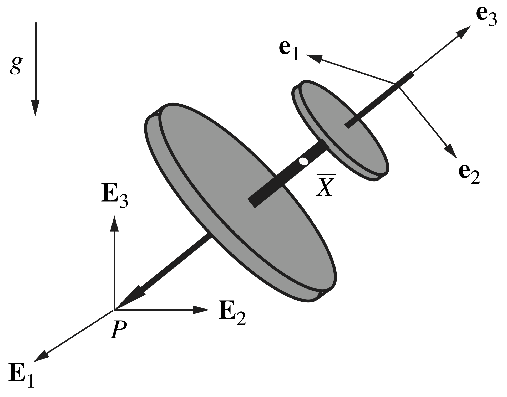

# The Lagrange Top
  


this script follows and re-creates the equations and simulations for Lagrange Top from this site [The Lagrange Top](https://rotations.berkeley.edu/the-lagrange-top/). See wikipage for the definition [https://en.wikipedia.org/wiki/Lagrange,_Euler,_and_Kovalevskaya_tops](https://en.wikipedia.org/wiki/Lagrange,_Euler,_and_Kovalevskaya_tops)


# 1. Equations of Motion


From figure 1 below, mass to be  and mass center  and assume the fixed point is . * *


\


So the angular moment of the top about its center of mass can be expressed as:  and the angular velocities are:


       (1)


The equations of motion for the Lagrange top may be obtained by applying a balance of linear momentum and a balance of angular momentum with respect to the top’s center of mass:  


 


respectively, where the top’s weight and the reaction forces at the fixed contact point  contribute to the net force and the net moment  about the mass center. The resulting differential equations from applying the balance laws can then be expressed in the first-order form:


  


for numerical integration in MATLAB, where . 


# 2. Code

```matlab:Code
%  Specify symbolic parameters and symbolic variables that are functions of
%  time:

syms psi(t) theta(t) phi(t) Dpsi(t) Dtheta(t) Dphi(t)
syms m g A C L
assume((m > 0) & (g > 0) & (A > 0) & (C > 0) & (L > 0))

%  (1)  Angular velocity kinematics:

%  Relate the space-fixed basis {E1,E2,E3} to the corotational basis
%  {e1,e2,e3} using a 3-1-3 set of Euler angles:

R1 = [cos(psi), sin(psi), 0;        
      -sin(psi), cos(psi), 0;
      0, 0, 1]; 
  
R2 = [1, 0, 0;                    	
      0, cos(theta), sin(theta);
      0, -sin(theta), cos(theta)];

R3 = [cos(phi), sin(phi), 0;        
      -sin(phi), cos(phi), 0;
      0, 0, 1];  
%  Express the angular velocity vector in terms of {e1,e2,e3}:  
omega = simplify((R3*R2*R1)*[0; 0; diff(psi)] + ...
                 (R3*R2)*[diff(theta); 0; 0] + R3*[0; 0; diff(phi)])
```

omega(t) = 

   

```matlab:Code
%  (2)  Kinematic constraints:

%  The top's point of contact P with the ground has zero velocity.

%  Integrable constraints:

vCOM = simplify([0; 0; 0] + transpose(R3*R2*R1)*cross(omega, [0; 0; L]));

Dx1 = [1, 0, 0]*vCOM;
Dx2 = [0, 1, 0]*vCOM;
Dx3 = [0, 0, 1]*vCOM;

x1 = simplify(int(Dx1));
x2 = simplify(int(Dx2));
x3 = simplify(int(Dx3));      

%  Simplify the kinematic equations for future manipulation: 

omega = subs(omega, [diff(psi), diff(theta), diff(phi)], [Dpsi, Dtheta, ...
             Dphi]);

Dx1 = subs(Dx1, [diff(psi), diff(theta), diff(phi)], [Dpsi, Dtheta, Dphi]);
Dx2 = subs(Dx2, [diff(psi), diff(theta), diff(phi)], [Dpsi, Dtheta, Dphi]);
Dx3 = subs(Dx3, [diff(psi), diff(theta), diff(phi)], [Dpsi, Dtheta, Dphi]);
```


```matlab:Code

%  (3)  Balance of linear momentum:

%  Solve for the normal (constraint) force, as well as the lateral
%  (constraint) forces required to keep the top's contact point P fixed:

F1 = m*diff(Dx1);
F2 = m*diff(Dx2);
N = m*diff(Dx3) + m*g;
```


```matlab:Code

%  (4)  Balance of angular momentum with respect to the top's mass center:

%  Taking the top to be axisymmetric, evaluate the absolute time derivative 
%  of the angular momentum about the mass center:

H = diag([A, A, C])*omega;
omegaRF = omega;

DH = diff(H) + cross(omegaRF, H);

%  Sum moments about the mass center:

sumM = cross([0; 0; -L], (R3*R2*R1)*[F1; F2; N]);

%  Construct the second-order ODEs for rotational motion of the top:

ODEsRot = DH == sumM;

```


```matlab:Code
%  (5)  Manipulate the system of ODEs into a form suitable for numerical 
%       integration:

%  Express the second-order ODEs in first-order form:

ODEsRot1 = simplify(subs(ODEsRot, [diff(psi), diff(theta), diff(phi)], ...
                         [Dpsi, Dtheta, Dphi]));

%  Manipulating the first two ODEs ultimately yields a cleaner form for the
%  state equations:                       

ODEsRot1 = [sin(phi), -cos(phi), 0;
            cos(phi), sin(phi), 0;
            0, 0, 1]*ODEsRot1;        
        
%  Relate the state variables in first-order form:

ODEsRot2 = [diff(psi) == Dpsi; diff(theta) == Dtheta; diff(phi) == Dphi];

%  Compile the state equations and arrange the state variables:
     
StateEqns = simplify([ODEsRot1; ODEsRot2]);

StateVars = [Dpsi; Dtheta; Dphi; psi; theta; phi];

%  Express the state equations in mass-matrix form, M(t,Y)*Y'(t) = F(t,Y):

[Msym, Fsym] = massMatrixForm(StateEqns, StateVars);

Msym = simplify(Msym)
```

Msym = 

   

```matlab:Code
Fsym = simplify(Fsym)
```

Fsym = 

   

```matlab:Code
%  Convert M(t,Y) and F(t,Y) to symbolic function handles with the input 
%  parameters specified:

M = odeFunction(Msym, StateVars, m, g, A, C, L);  
F = odeFunction(Fsym, StateVars, m, g, A, C, L); 
```

  
# 3. Simulations of general motion


For an arbitrary choice of initial conditions for the Euler angles and their rates of change, numerical simulation shows that the Lagrange top generally behaves like a spherical pendulum, assuming the top is allowed to fall below the horizontal. A typical example of this pendulum-like behavior is animated below


```matlab:Code
%  Physical parameters:

m = 8/1000;                     %  kg
g = 9.81;                       %  m/s^2
r = 20/1000;                    %  m
A = 1/4*m*r^2;            %  kg-m^2
C = 1/2*m*r^2;            %  kg-m^2
L = 20/1000;                   %  m

%  Simulation parameters:

dt = 0.001;                     %  s
tf = 2;                         %  s
tsim = [0 : dt : tf]';          %  s    
tol = 1e-6;

option=2;
% initial parameters 
if option==1

    psidot0 = 1*(2*pi);             %  rad/s
    thetadot0 = 0*(2*pi);           %  rad/s
    phidot0 = 4*(2*pi);             %  rad/s
    psi0 = 0*(pi/180);              %  rad
    theta0 = 30*(pi/180);           %  rad
    phi0 = 0*(pi/180);              %  rad
    
    Y0 = [psidot0, thetadot0, phidot0, psi0, theta0, phi0]';

elseif option==2
    %  Initial conditions for steady motion of the top.  Specify the rate of
    %  precession and the nutation angle to determine the required spin rate:
    
    psidot0 = 1*(2*pi);         %  rad/s
    theta0 = 30*(pi/180);       %  rad
    
    phidot0 = ((A - C + m*L^2)* ...                    %  rad/s
                cos(theta0)*psidot0^2 + m*g*L)/(C*psidot0);
    
    Y0 = [psidot0, 0, phidot0, 0, theta0, 0]';
end

%  Plotting parameters:

span = [0.8, 1.2];
```


```matlab:Code
%  Convert M(t,Y) and F(t,Y) to purely numeric function handles for
%  numerical integration:

M = @(t, Y) M(t, Y, m, g, A, C, L);
F = @(t, Y) F(t, Y, m, g, A, C, L);

```


```matlab:Code
%  Numerically integrate the state equations:

options = odeset('mass', M, 'abstol', tol, 'reltol', tol);

[t, Y] = ode45(F, tsim, Y0, options);
```


```matlab:Code
plotTopResponse; % plot the response
```


```text:Output
Unrecognized function or variable 'plotTopResponse'.
```


```matlab:Code

tpause=0; 
animate_lagrange_top(L, psi, theta, phi, x1, x2, x3, dt, tpause);

```

  
  
  
  


  


 


